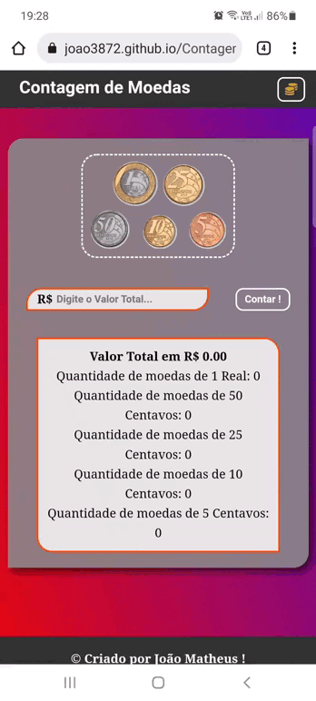
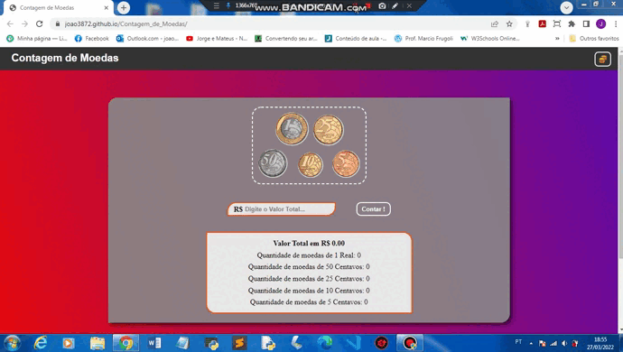

## Contagem de Moedas 🪙

### Sobre a Página:

* É um contador de moedas, no qual, retorna a quantidade de moedas necessárias para completar o valor, de acordo com o valor digitado no input.

* Retorna a quantidade de moedas de 1 Real, 50 Centavos, 25 Centavos, 10 Centavos e 5 Centavos.

* Retorna a diferença de Centavos entre as moedas de 1 real, 50 Centavos e 25 centavos, quando o valor digitado no input é um número Real / Flutuante.

* E possui um checkbox, no qual, faz a chamada de uma função, que permite o cálculo do valor em Reais de cada Moeda. De acordo, com o valor informado no input.

### Sobre a Modal:

* O input, recebe apenas números Inteiros. É permitido, apenas a contagem de duas moedas por vez.

* Caso, seja selecionada mais de duas moedas ou apenas uma, não será exibido nenhum retorno.

* Caso, o valor do input seja vázio ou igual a 0 (zero), também não terá retorno.

* Quando são escolhidas duas moedas, será exibida apenas uma resposta por vez.

* Neste caso, a resposta terá como retorno, a metade da quantidade total das duas moedas. Por exemplo, se o total for R$ 10, e você selecionar moedas de 50 centavos e moedas de 25 centavos, os valores gerados serão: 10 moedas de 50 + 20 moedas de 25.

* E por fim, temos um icon de Ajuda. No qual, exibirar os passos necessários para fazer o uso do contador, quando passar o cursor do mouse.

### Versão Mobile 📱:

### Versão Desktop 💻:

### Retorno em Reais de cada Moeda:

### Experimente você mesmo:

* <a href="https://joao3872.github.io/Contagem_de_Moedas/" target="_blank">Acesso a Página</a>
